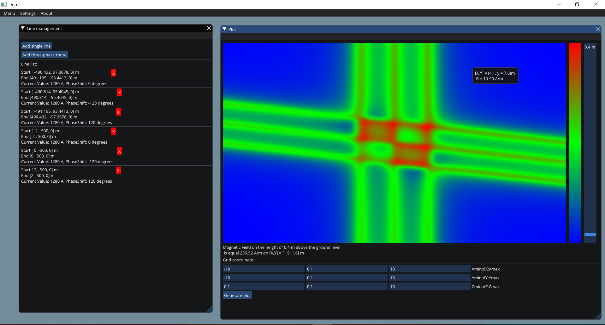

# MagneticField3D
This software allows calculating Magnetic Field in a three-dimensional environment inducted by power lines, underground cables, and cable poles.

## Used technologies and interface presentation
The application was written in Julia programming language and it uses Julia CImGui wrapper and calculating algorithm implemented with CUDA technology. It has a responsive window and plot, and many input options that allow inputting data cables in a straight way by raw coordinates or by trefoil or flat formation and changing phase order. The plot is generated using the OpenGL backend contained in CImGui. It also has a main menu bar in which we can change the properties of the interface view and style. The program is just a demo version. The app will be improved and more modules will be added in the future.

## Calculation base and performed tests
Program calculations are based on Krzysztof Budnik, Wojciech Machczynski "Calculation in 3D of magnetic fields generated by underground cable of complex geometry" in the approach of three-phase lines and single lines which are included here for theoretical tests of an application.
The calculations were entirely verified on a large number of tests including:
- Implementing 2D data tests including i.a. in "EPRI AC Transmission Line Reference Book-200 kV and Above, Third Edition" and "CYMCAP 7.2 Reference Manual and Users Guide" to 3D application
- Theoretical and mathematical tests including:
  - Basic test of long straight single line field values in function of crow-fly distance
  - Test of symmetry in case of two crossing perpendicularly single lines of any current value, but the same phase depends on the current flow direction
  - Test of symmetry in case of two crossing perpendicularly three-phase routes of the same phase shift in depend on current flow direction or phase order

